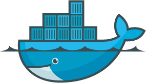

#  Docker 

**Docker** 是一個開放原始碼軟體專案，讓應用程式布署在軟體容器下的工作可以自動化進行，藉此在 *Linux* 作業系統上，提供一個額外的軟體抽象層，以及作業系統層虛擬化的自動管理機制。

其利用 *Linux* 核心中的資源分離機制，例如 *cgroups*，以及 *Linux* 核心命名空間（*namespace*），來建立獨立的軟體容器（containers），便可以在單一 *Linux* 實體下運作，避免啟動一個虛擬機器造成的額外負擔。

## 前言
個人訂定的個人目標之一，就是撰寫出一系列完整的教學文件，分別有：
- [Docker](#-docker)
- Promethues
- ELK
- Jenkins

第一個要完成的是 - *Docker*。

雖然網路上有許多關於 Docker 的電子書籍或教學資料，但想先以 Docker 為練習，嘗試整理出屬於自己的一系列教學文件，並且會在各實作章節中，提供充足的練習範例。

目前已在目錄中列出預計撰寫的章節，如果對於該目錄有任何問題，或是覺得應該要有的章節，都可以來信建議！

## 導讀
> 暫無

## 目錄

### 入門

- [Docker 簡介](introduction#簡介)
- [基礎結構介紹](basic-structure#基礎結構介紹)
    - [Docker](basic-structure/docker.md#dokcer)
    - [分層儲存](basic-structure/layer-storage.md#分層儲存)
        - [鏡像（Image）](basic-structure/layer-storage.md#鏡像)
        - [容器（Container）](basic-structure/layer-storage.md#容器)
    - [儲存倉（Registry）](basic-structure/registry.md#儲存倉)
    - [儲存驅動（Storage Driver）](basic-structure/storage-drivers.md#儲存驅動)
- [安裝 Docker](installation/#安裝-docker)
    - [Unix-like](installation/#unix-like)
    - [MacOSX](installation/#macosx)
- [儲存倉](registry/#儲存倉)
    - [登入/出](registry/login&out.md#登入出)（ [login](registry/login&out.md#login)/ [logout](registry/login&out.md#logout)）
- [鏡像](image/#鏡像)
    - [儲存倉上搜索、拉取、標籤與推送](image/pull&push.md#儲存倉上搜索拉取標籤與推送)（ 
        [search](image/pull&push.md#search)/
        [pull](image/pull&push.md#pull)/
        [tag](image/pull&push.md#tag)/
        [push](image/pull&push.md#push)）
    - [本地查詢](image/list.md#本地查詢)（[images](image/list.md#images)）
    - [建構與移除](image/build&remove.md#建構與移除)（ 
        [build](image/build&remove.md#build)/ 
        [rmi](image/build&remove.md#rmi)）
    - [儲存與載入](image/save&load.md#儲存與載入)（ 
        [save](image/save&load.md#save)/ 
        [load](image/save&load.md#load)）
    - [鏡像管理](image/manage-image.md#鏡像管理)（[image](image/manage-image.md#image)）
- [Dockerfile](dockerfile/#dockerfile)
    - [指令集](dockerfile/instructions.md#dockerfile-指令集)
    - [設計技巧](dockerfile/design-tips.md#設計技巧)
- 容器
    - 創建和移除（ create/ rm）
    - 狀態查詢（ps）
    - 運行控制（ start/ stop/ pause/ unpause/ kill）
    - 額外指令執行（exec）
    - 檔案複製（cp）
- 卷宗
    - 創建和移除（ create/ rm）
    - 條列顯示（ls）
- 問題查找
    - top, stats
    - history
    - logs
    - diff
    - inspect
- 服務應用
    - nginx
    - [vsftp](https://github.com/48763/vsftpd-on-dodcker)

### 進階

- 容器
    - stack
- [儲存倉](registry#儲存倉)
    - distribution
    - docket
    - [Harbor](registry/harbor#-harbor)
- Compose
- 叢集
    - Swarm 
        - node
        - service
    - Kubernetes
- Daemon 配置
