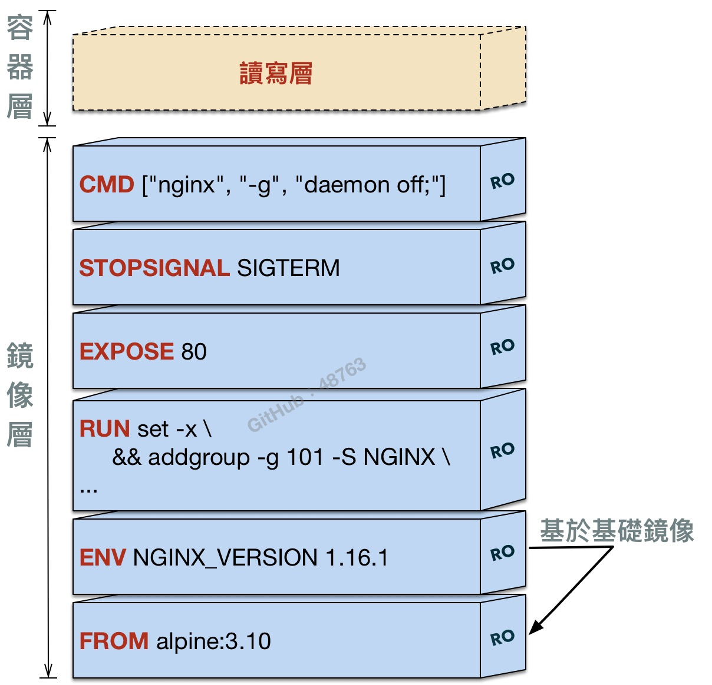

# 分層儲存

> 附圖參照 [nginxinc](https://github.com/nginxinc/docker-nginx) 在 github 專案中的 [dockerfile](./Dockerfile) 所繪製而成。

所有的容器都是基於鏡像去創建*薄讀寫層（Thin R/W layer）*，該層也稱為容器層（container layer）或是寫入層（writable）。而鏡像是利用聯合檔案系統（[union filesystem](https://en.wikipedia.org/wiki/UnionFS)）進行分層創建[[1]](#參考)而成。

*聯合檔案系統有許多不同的實作（例如：AUFS 或 overlay2 ...等），詳閱：[儲存驅動](./storage-drivers.md#儲存驅動)*

### 鏡像

- 鏡像（Image）是由數個分層（layers）所堆疊建構而成；
- 每個分層都代表 Dockerfile 中的一個指令；
- 分層與分層之間只會有一組差異；
- 鏡像中的每個分層僅允許唯讀（read-only）。

### 容器

- 當創建容器時，將會基於鏡像去新增讀寫層在最頂端；
- 運行中的容器所有更動（如：新增檔案、修改檔案和刪除檔案），都只在該讀寫層做更動；
- 讀寫層中的讀寫速度，相較於本機文件系統來的低；
- 讀寫層與主機是緊密耦合，所以無法輕易將其資料移動；
- 當容器刪除時，讀寫層中的所有數據也隨刪除。

## 參考

[1] Docker, [DOCKER OVERVIEW](https://docs.docker.com/engine/docker-overview/#union-file-systems), English