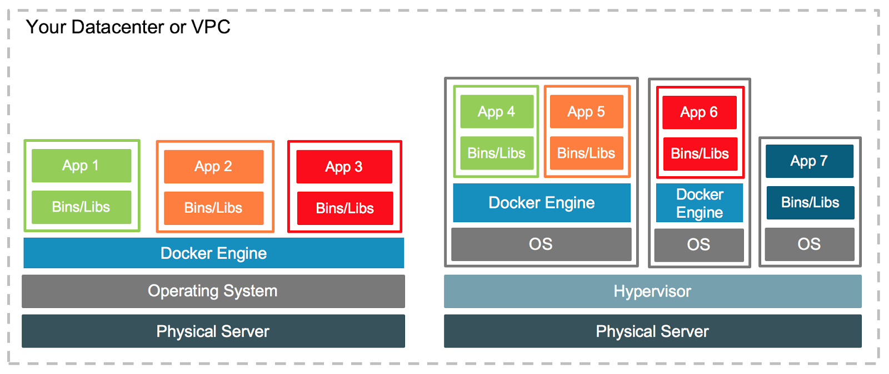

# 簡介

*Docker* 是由 *dotCloud* 這家公司所開發。原先該公司投入雲端運算服務── [*PaaS*][i]（中文：平台即時服務，英文：Platform as a Service。提供用戶多樣的雲端服務平台，用戶只需透過網路連結控制應用程式，即可對雲端服務平臺進行部署及相關應用操作），但當時已有許多提供雲端服務的大型公司（如：*AWS*、*Azure*），以至於 *PaaS* 市場拓展速度緩慢，公司業務無法起色。

*dotCloud* 的創辦人 *Solomon Hykes* 在公司面臨如此的窘境，最後決定放手一搏，將方便調用 [*LXC*][ii]（Linux Containers：是一個 Linux 容器功能的 API）的工具開源給大家使用，也意外的在短時間就獲得高度響應，而它就是我們熟知的──*Docker*。

## Docker 與 VM 架構比較

Docker 所使用的虛擬化技術與 VM（[Virtual Machine](https://zh.wikipedia.org/wiki/虛擬機器)）不同，從下圖中能清楚對比兩種架構，可以發現 docker 上所運行的應用，不需要再安裝一個完整的作業系統。

[[1]](#參考)

為何 docker 的虛擬化技術不需要再安裝作業系統，便能在上面運行應用服務呢？

最初的 docker 是建構在 [*LXC*][ii] 的抽象層之上。所以當容器內的應用需要系統調用（[system calls][iv]），就會透過 *docker deamon* 的機制，存取到本機的 Linux 核心（[kernel][v]），也因此節省了在虛擬機裡的系統資源開銷。Docker 在 0.9 版開始，*docker deamon* 開始使用自己開發的函式庫 - *libcontainer*。

- [libcontainer]()

## Docker 實務上的優點

這裡整理出幾個實務場景，並描述以往在實務上會遇到的問題，以及使用 *docker* 所帶來的優點與效益。

### 1. 開發人員生產

傳統開發中，人員在專案開發時，都需要建立虛擬機和搭建環境，以提供開發使用。但建立的過程中，往往都相當傷神費時。

#### 使用 docker 時 - 

- 快速搭建開發環境：

可使用簡易的指令（如 - `docker run`），便能在極短時間內，啟用一個或多個運行該環境的容器（[container](#docker-與-vm-架構比較)）。

### 2. 伺服器整合

當要建立資料庫或其它應用的叢集（[cluster][vi]）時，每新增一個節點，就會需要新建一個完整的操作系統。

#### 使用 docker 時 - 

- 減少操作系統的內存佔用：

每新建一個應用服務的容器，不需要再建立完整的操作系統，便能省去其硬碟和記憶體的開銷。

### 3. 流水線（[pipeline][vii]）代碼管理

在軟體開發時，每位人員的電腦環境多少都會有差異。而各自開發的模組或服務的配置，可能會因為部署環境中，某個套件版本或系統版本只差 `v0.0.1`，而導致其無法正常的動作。

#### 使用 docker 時 - 

- 開發環境的一致性：

只要每位協作人員使用相同的鏡像（[image][viii]）以運行容器（[container][ix]），便能使人員的開發環境保持一致性。

- 簡化開發管道（[pipeline][vii]）：

在開發過程中，人員不太需要顧慮到系統與環境的建置，只要容器一啟用，便能專注於開發上。

### 4. 軟體交付（[deliverables][x]）

在專案建構（[construction][xi]）前，會去瞭解用戶部署應用的環境（如：系統、程式語言、服務版本...等）。但在軟體交付部署時，可能會出現許多非預期的狀況。

#### 使用 docker 時 - 

- 簡化部署管道（[pipeline](vii)）：

當建構完成時，可以將其環境需求及代碼全都打包至鏡像（[image][viii]），便能將其交付予客戶至伺服器上運行容器（[container][ix]）。

- 降低應用與系統間的耦合：

在部屬的過程中，不需過於顧慮系統版本或是環境，只要確認系統是否能夠運行 *docker* 即可。

### 5. 快速部署

線上應用服務需要添加、更新或是擴展應用時，以往都需要將服務下線維護，其過程可能會非常繁雜耗時，才能將其更新完畢。

#### 使用 docker 時 - 

- 快速更新節點容器：

當使用 [`docker stack`]()、[`docker-compose`]() 或是 [`docker swarm`]() 進行部署時，只要使用簡單的指令（與[快速搭建開發環境](#1-開發人員生產)雷同），就能快速完成部署任務。

### 6. 偵錯（[Debugging][xii]）功能

#### 使用 docker 時 - 

- 替容器設置檢查點
- 查看兩個容器之間的差別

<!--
### 7. 多租戶（Multi-Tenancy）
- 避免關鍵應用的重寫
-->

## 參考

[1] Mike Coleman, [CONTAINERS AND VMS TOGETHER](https://blog.docker.com/2016/04/containers-and-vms-together/), April 8 2016, English

<!--hyperlink-->

[i]: https://zh.wikipedia.org/wiki/平台即服務 "Wiki, 平台即服務, Chinese"
[ii]: https://linuxcontainers.org/lxc/introduction/#features "Linuxcontainers, What's LXC?, English"
[iii]: https://zh.wikipedia.org/wiki/虛擬機器 "Wiki, 虛擬機器, Chinese"
[iv]: https://zh.wikipedia.org/wiki/系統調用 "Wiki, 系統調用, Chinese"
[v]: https://zh.wikipedia.org/wiki/內核 "Wiki, 內核, Chinese"
[vi]: https://zh.wikipedia.org/wiki/電腦叢集 "Wiki, 電腦叢集, Chinese"
[vii]: https://en.wikipedia.org/wiki/Pipeline_(software) "Wiki, Pipeline, English"
[viii]: ../basic-structure/layer-storage.md#分層儲存 "48763, 分層儲存, Chinese"
[ix]: ../basic-structure/layer-storage.md#分層儲存#容器 "48763, 分層儲存#容器, Chinese"
[x]: https://en.wikipedia.org/wiki/Deliverable "Wiki, Deliverable, English"
[xi]: https://en.wikipedia.org/wiki/Software_construction "Wiki, Software construction, English"
[xii]: https://zh.wikipedia.org/wiki/偵錯 "Wiki, 偵錯, Chinese"
