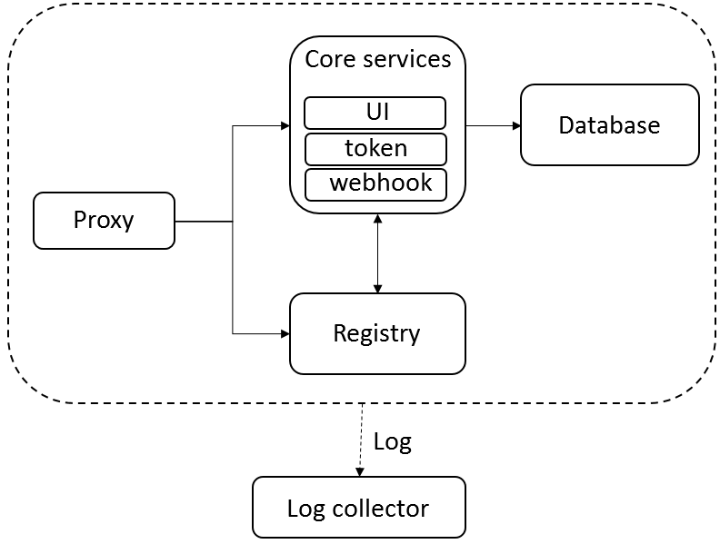

# <a href="https://goharbor.io"></a> HARBOR

*Harbor* 是一個開源的可信任雲端原生（cloud native）儲存倉（registry）專案，用於儲存、簽名和掃描內容。其擴展了開源軟體 - Docker Distribution，添加企業經常需要的功能，如：安全性、身份驗證和鏡像管理。

*Harbor* 由 [Cloud Native Computing Foundation](https://www.cncf.io/)（CNCF）託管。


## 目錄
  - [特性](#特性)
  - [系統需求](#系統需求)
  - [架構](#架構)
  - [下載安裝器](#下載安裝器)
  - [配置](#配置)
  - [安裝](#installation)

## 特性

- 雲端原生儲存倉（registry）：作為雲端原生環境的儲存倉（如容器運行時和編排平台），支持容器鏡像和 [*Helm*](https://helm.sh/) 圖表。
- 基於角色的訪問控制：用戶和儲存庫（repositories）能通過項目進行組織，使每個專案底下的用戶，針對鏡像(images）會有不同的權限。
- 基於策略的鏡像複製：基於多個過濾器（儲存庫、標記和標籤）策略，在多個儲存倉之間複製（同步）鏡像。Harbor 如果遭遇到任何錯誤，將自動重試複製。非常適合負載平衡、高可用性、多數據中心、混合和多雲端場景。
- 漏洞掃描：Harbor 定期掃描鏡像，並能警告用戶漏洞。
- 支援 LDAP/AD：Harbor 整合現有的企業 LDAP/AD，以進行用戶身份驗證和管理，並支持導入 LDAP 群組至 Harbor，為其分配適當的專案角色。
- 鏡像刪除和垃圾收集：可以刪除鏡像，並且能回收其的空間。
- Notary：可以保證鏡像的真實性。
- 使用者圖形介面：用戶可以輕鬆瀏覽、搜索存儲庫（repositories）和管理項目。
- 審計：跟蹤存儲庫（repositories）的所有操作。
- RESTful API：RESTful API 適用於大多數的管理操作 ，能輕鬆的與外部系統集成。
- 簡易部署：提供在線和離線安裝程式。

## 配置、安裝和運行

### 系統需求：

在 Linux 系統上：
- docker 17.03.0-ce+
- docker-compose 1.10.0+

## 架構



## 下載安裝器

安裝器的二進檔可以從發布頁面下載。可選擇線上或離線安裝器。
- Open-source Harbor project:
  - [Harbor offline installer](https://storage.googleapis.com/harbor-releases/release-1.5.0/harbor-offline-installer-v1.5.0-rc1.tgz)
  - [Harbor online installer](https://storage.googleapis.com/harbor-releases/release-1.5.0/harbor-online-installer-v1.5.0-rc1.tgz)

下載解壓縮。
```
beladmin@swarm-registry:~$ wget https://storage.googleapis.com/harbor-releases/release-1.5.0/harbor-online-installer-v1.5.0-rc1.tgz
beladmin@swarm-registry:~$ tar xvf harbor-online-installer-v1.5.0-rc1.tgz 
```

## 配置

修改 `harbor.cfg` 裡的參數。

```
beladmin@swarm-registry:~$ cd harbor/
beladmin@swarm-registry:~$ vi harbor.cfg 
...
#The IP address or hostname to access admin UI and registry service.
#DO NOT use localhost or 127.0.0.1, because Harbor needs to be accessed by external clients.
hostname = 192.168.200.49
...
##The initial password of Harbor admin, only works for the first time when Harbor starts. 
#It has no effect after the first launch of Harbor.
#Change the admin password from UI after launching Harbor.
harbor_admin_password = beladmin
...
beladmin@swarm-registry:~$ 
```

## 安裝

安裝過程需要等待數分鐘。

```
sudo ./install.sh 
```

安裝完畢後連接網頁即可使用。
```
http://192.168.200.49/
```
